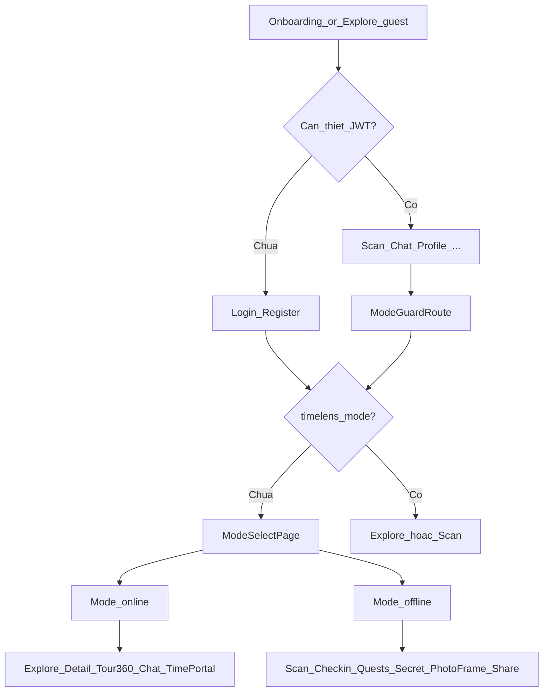

# TimeLens FE — Đối chiếu Tuần 1–3, workflow & BE

> **Cập nhật:** 2026-06-02 (kiểm tra cuối — logic vận hành + tương thích BE)  
> **Nguồn:** `TimeLens_FE_Spec.docx`, `BE/docs/week-1|2|3`, `BE/docs/BE_PROJECT_STATUS_AND_FE_GUIDE.md`

---

## Kết luận kiểm tra cuối

**FE workflow Tuần 1–3 đã khớp spec và contract BE.** Luồng Online/Offline, auth, API envelope, Virtual Tour và responsive chạy nhất quán. Các điểm còn lại là **vận hành prod** (deploy URL, CORS, SQL ảnh 360) và **nice-to-have** (form sửa profile, E2E), không chặn demo golden path.

| Tiêu chí | Đánh giá |
|----------|---------|
| Nguyên tắc vàng spec (không rewrite, token, bám BE) | ✅ |
| Tuần 1 checklist FE | ✅ |
| Tuần 2 checklist FE | ✅ |
| Tuần 3 checklist FE (code) | ✅ |
| Workflow ăn khớp nhau | ✅ (đã sửa giữ `?query` qua login → mode-select → đích) |
| `npm run lint` + `npm run build` | ✅ |

---

## Workflow vận hành (logic)

### Thứ tự điều hướng (đã verify trong code)

1. **Guest** — `/explore`, `/explore/:id`, `/quests`, `/tour/360`, `/time-portal`, `/leaderboard` không cần JWT.
2. **Đăng nhập** — `ProtectedRoute` → nếu chưa auth → `/login` (lưu `from` = path + query).
3. **Sau login** — nếu chưa `timelens_mode` → `/mode-select` (giữ `from` trong state).
4. **Sau chọn mode** — đi `from` nếu có (vd. Chat có `locationId`), không thì Online → `/explore`, Offline → `/scan`.
5. **Mode** — không khóa route mode kia; SideNav/TopNav chỉ highlight + badge.
6. **Đổi mode** — badge TopNav → `/mode-select`.

### Golden path Online (JWT + mode online)

`Login` → `ModeSelect` "Khám phá từ xa" → `Explore` → `HeritageDetail` (Củ Chi `11111111-...`) → `Tour360` (Virtual Tour ≥3 scene) → `Chat` (reply có dòng `Nguồn:`) → `TimePortal` (photo-pairs).

### Golden path Offline (JWT + mode offline)

`ModeSelect` "Đang tại di tích" → `Scan` (QR `timelens:location:{uuid}` + GPS) → `Quests` → `QuestDetail` (start/progress) → `SecretStory` → `PhotoFrame` → `Share`.

---

## Nguyên tắc vàng (spec mục 1)

| Nguyên tắc | Trạng thái |
|------------|------------|
| Nâng cấp, không rewrite `features/` + layout Stitch | ✅ |
| Token `design/tokens.ts` + `globals.css` | ✅ |
| `getData` / `getListData` / `getPageData`; leaderboard `entries` | ✅ |
| Copy tiếng Việt + `useToast` | ✅ |
| lint + build pass | ✅ |

---

## Tuần 1 — FE ↔ BE

| Hạng mục | FE | BE contract |
|----------|-----|-------------|
| `data.items` paginated | ✅ | locations, quests, me/quests, chat messages |
| AppMode + `timelens_mode` | ✅ | Không cần API BE |
| Virtual Tour đa scene | ✅ | panoramas + hotspots `type:scene` |
| Chat `Nguồn:` | ✅ `ChatMessageContent` | BE append trong `reply` string |
| Refresh token 401 | ✅ | `POST /api/auth/refresh` |
| Validation 422 | ✅ | `getFriendlyErrorMessage` |

---

## Tuần 2 — FE

| Hạng mục | Trạng thái |
|----------|------------|
| Polish 5 màn ưu tiên | ✅ |
| Loading / error / empty | ✅ |
| Quest seed chỉ `VITE_DEMO_MODE` | ✅ |
| Responsive phone / tablet / laptop | ✅ |
| Explore pagination "Xem thêm" | ✅ |

---

## Tuần 3 — FE

| Hạng mục | Trạng thái | Ghi chú |
|----------|------------|---------|
| `imageUrl` HTTPS từ BE (không Street View hardcode) | ✅ | Fallback `images.tour360Panorama` khi placeholder |
| Lazy Virtual Tour + mobile gestures | ✅ | |
| `vercel.json` + `.env.example` | ✅ | |
| Cảnh báo localhost trên prod build | ✅ `env.ts` | |
| PhotoFrame resize 1080px + `crossOrigin` | ✅ | |
| Deploy / survey / video pitch | 🟡 Thủ công team | Không phải code FE |

---

## Trạng thái BE (tóm tắt cho FE)

Theo `BE/docs/BE_PROJECT_STATUS_AND_FE_GUIDE.md`:

| Giai đoạn BE | Trạng thái | API chính FE dùng |
|--------------|------------|-------------------|
| Week 1 — Content | **Done** | locations, characters, photo-pairs, panoramas, hotspots, chat, auth |
| Week 2 — Gamification | **Done** | checkins, quests, progress, badges, secret-story |
| Week 3 — Viral | **Done** | photo-frames, user-creations, share, leaderboard |
| Week 4 — Demo/Prod | **Done** | health/ready, demo check-in |
| Sprint compat 2026-06-02 | **Done** | pagination, 422, refresh, location fields, quest progress |
| Tuần 3 — Panorama SQL + deploy | **Ops** | `2026-week3_update_panoramas_cu_chi.sql` sau upload CDN |

**FE không cần đổi client** khi BE cập nhật `imageUrl` panorama — Virtual Tour đọc trực tiếp từ API.

### SQL seed BE (local demo)

Chạy theo thứ tự trong handoff:

1. `TimeLens_DB_Schema.sql`
2. `2026-06-02_fe_compat_migration.sql`
3. `2026-06-02_fe_compat_indexes_seed.sql`
4. `2026-06-02_fe_compat_data_topup.sql`
5. `week-1/2026-week1_location_sources.sql`
6. (Tuần 3) `week-3/2026-week3_update_panoramas_cu_chi.sql` — sau có URL ảnh thật

---

## Spec checklist (mục 11) — hoàn tất

- [x] AppMode + ModeSelect + TopNav badge
- [x] Online / Offline flow
- [x] Virtual Tour đa scene
- [x] Chat Nguồn
- [x] Quest seed chỉ DEMO_MODE
- [x] Loading/error/empty
- [x] Responsive + theme
- [x] lint + build

---

## Kiểm tra UX / điều hướng (2026-06-02)

| Vấn đề | Trạng thái |
|--------|------------|
| Mất `?query` qua login → mode-select | ✅ Đã sửa trước đó |
| Header trùng trên mobile (TopNavCompact + ExploreTopNav/DetailHeader) | ✅ `hidden md:flex` + `TopNavCompact` có nút Quay lại |
| Thiếu nút quay lại mobile (Chat, 360, Time Portal, Secret, Share…) | ✅ `mobileBackTo` trên `AppLayout` |
| Mode badge guest → `/mode-select` rồi login vòng vòng | ✅ Guest thấy "Đăng nhập"; đã login mới vào mode-select |
| Đổi mode xong quay lại đúng trang | ✅ Badge truyền `from` vào mode-select |
| Tour 360 panel che bottom nav mobile | ✅ `bottom-20` + `pb-16` |
| Mode select full-screen bị header mobile | ✅ `hideMobileChrome` |
| Stats 3 cột quá chật trên phone (Heritage detail) | ✅ `grid-cols-1 sm:grid-cols-3` |

---

## Known gaps (không chặn CP3 demo)

| Gap | Mức độ | Ghi chú |
|-----|--------|---------|
| `PATCH /api/profile/me` — chưa có form UI | P2 | API client đã có |
| `CharacterRoster.tsx` vẫn mock — **không mount** trên route | P3 | Dead code, không ảnh hưởng flow |
| Chat history pagination UI | P2 | API có `page`/`size` |
| E2E Playwright | P3 | Ngoài scope |
| AR | — | Roadmap |
| Pixel-perfect 100% Stitch | P2 | Focus Group tùy feedback |

---

## Deploy production (Tuần 3 Ngày 17)

1. BE prod HTTPS + CORS = domain Vercel
2. Vercel: `VITE_API_URL=https://<be-prod>`
3. `VITE_DEMO_ENABLED=false` trên prod pitch
4. Test: login &lt; 30s, Explore, 360 xoay, Chat + Nguồn, check-in hoặc demo backup
